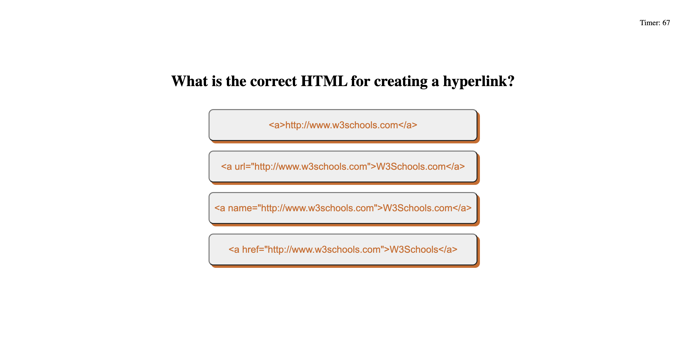

# A Coding Assessment App


## Screenshots



## Description


## Future Implementations


## Code Snippets

```
// Helper function to retrieve data from local storage
function getScoresFromLocalStorage(quizContainer) {
    // Check if localStorage is empty or not to determine what to render
    if (localStorage.getItem("scores") !== null) {
        // Get user info from localStorage
        var arr = JSON.parse(localStorage.getItem("scores"));

        // Order from highest to lowest score by first saving each userScore in an array, sort the array in descending order, and get corresponding userInitials
        var scoreArr = arr.map(userObj => userObj.userScore);
        scoreArr.sort((a, b) => b - a);
        
        // Append localStorage results to the screen in descending order
        for (var i = 0; i < scoreArr.length; i++) {
            var j = 0;
            while (j < arr.length) {
                if (scoreArr[i] === arr[j].userScore) {
                    var result = document.createElement("p");
                    result.setAttribute("class", "score-text");
                    result.textContent = (i + 1) + ". " + arr[j].userInitials + "   -   " + arr[j].userScore;
                    quizContainer.appendChild(result);
                }
                j++;
            }
        } 
    } else {
        // If localStorage is empty, announce user they haven't played yet
        var result = document.createElement("p");
        result.setAttribute("class", "score-text");
        result.textContent = "No scores have been registered yet.";
        quizContainer.appendChild(result);
    }
}
```

To populate the high scores board page, I needed to make sure I was correctly accessing and retrieving the data from the local storage. The first thing I had to check was whether the local storage had any content at all. If it was empty, the function would render a sentence letting the user know they haven't taken the quiz yet and, therefore, no scores can be displayed. In case the local storage isn't empty -- meaning the user has taken the quiz at least once -- we need to make sure we're parsing the content correctly and displaying the scores in descending order. This is how it was done:

1. We make sure we retrieve the data and parse it. Our variable `arr` is an array of JavaScript objects now.
2. I created a separate array (`scoreArr`) that only contains the user scores from the `arr` variable and sort these in descending order.
3. For every element in the `scoreArr` array, we'll iterate through the `arr` array to find its corresponding `userInitials`. Once we do, we'll display the user's initials with their corresponding score.
4. Step 3 will repeat until we have traversed the arrays (which are of the same length).

## Technologies Used

HTML, CSS, JavaScript, and Git

## Deployment link

https://laurasierra17.github.io/coding-assessment/

### User Information
- [LinkedIn](https://www.linkedin.com/in/laurasierra2022)
- [Portfolio](http://www.laura-sierra.com)